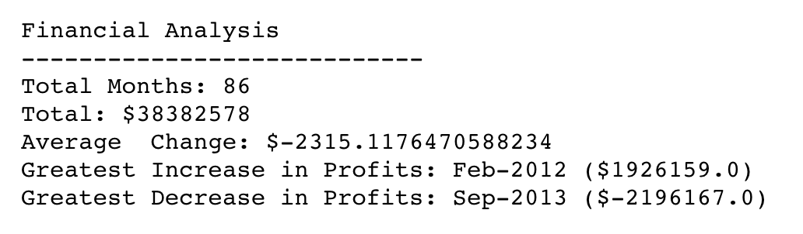
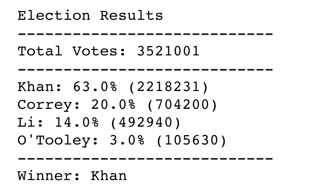

# pyBank

I created a Python script for analyzing the financial records of a company. I used a financial data set called budget_data.csv. The dataset is composed of two columns: Date and Profit/Losses. I calculated the following: 

#pyPoll 

I analyzed polling data from a data set called election_data.csv.  The dataset is composed of three columns: Voter ID, County, and Candidate. I calculated the following: 

## Built With
* Pandas 
* Numpy 
